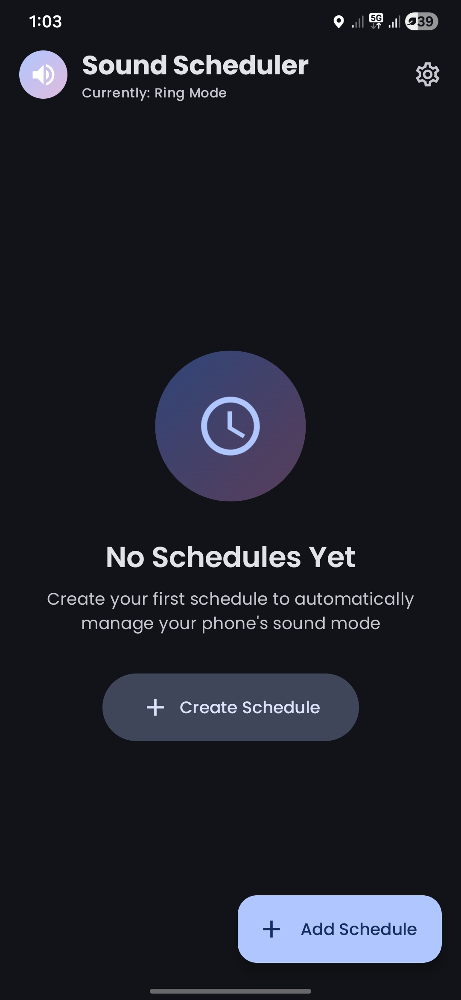
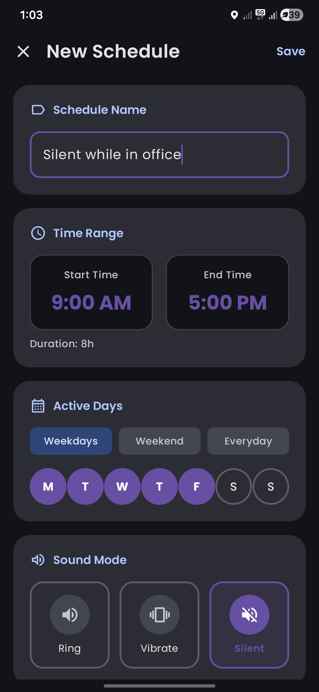
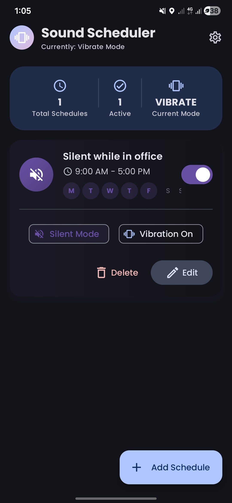
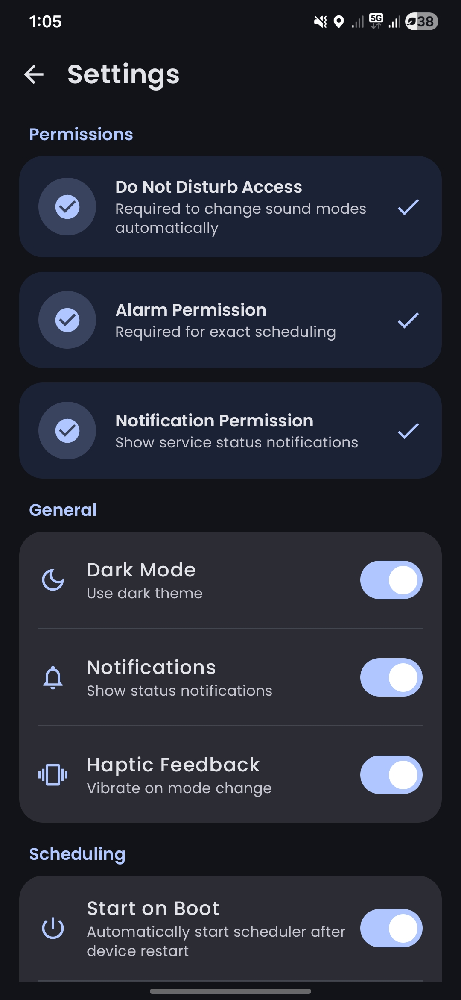
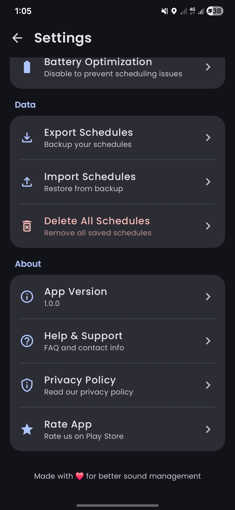

<div align="center">
  
# 📱 Smart Sound Scheduler

### Automatically manage your phone's sound mode based on your schedule

[](https://android.com)
[](https://kotlinlang.org)
[](https://developer.android.com/jetpack/compose)
[](https://m3.material.io)
[](LICENSE)
[](https://buymeacoffee.com/studiodoctor)



[Features](#-features) • [Screenshots](#-screenshots) • [Installation](#-installation) • [Tech Stack](#-tech-stack) • [Architecture](#-architecture) • [Contributing](#-contributing) • [Support](#-support)

</div>

---

## 🎯 About

**Smart Sound Scheduler** is a powerful Android application that automatically switches your phone between Ring, Silent, and Vibrate modes at scheduled times. Perfect for work meetings, sleep schedules, classes, or any situation where you need your phone to be quiet automatically.

Never forget to silence your phone during meetings or unmute it after work again! Set it once and let the app handle the rest.

---

## ✨ Features

### Core Features
| Feature | Description |
|---------|-------------|
| 🔔 **Multiple Sound Modes** | Switch between Ring, Silent, and Vibrate modes |
| ⏰ **Unlimited Schedules** | Create as many time slots as you need |
| 📅 **Day Selection** | Choose specific days for each schedule |
| 🌙 **Overnight Support** | Schedules that cross midnight work perfectly |
| 🔄 **Auto-Restart** | Schedules persist after device reboot |

### Smart Features
| Feature | Description |
|---------|-------------|
| ⚠️ **Conflict Detection** | Smart algorithm prevents overlapping schedules |
| 💡 **Alternative Suggestions** | Get suggestions when conflicts are detected |
| 📊 **Quick Presets** | One-tap selection for Weekdays, Weekends, or Everyday |
| 🎨 **Color Coding** | Assign colors to easily identify schedules |

### User Experience
| Feature | Description |
|---------|-------------|
| 🎨 **Material 3 Design** | Beautiful, modern UI following latest design guidelines |
| 🌓 **Dark Mode** | Full dark mode support |
| ✨ **Smooth Animations** | Delightful micro-interactions throughout |
| 📱 **Dynamic Colors** | Adapts to your device's wallpaper colors (Android 12+) |

---

## 📸 Screenshots

<div align="center">
<table>
  <tr>
    <td></td>
    <td></td>
    <td></td>
    <td></td>
    <td></td>
  </tr>
  <tr>
    <td align="center"><b>Home Screen</b></td>
    <td align="center"><b>Add Schedule</b></td>
    <td align="center"><b>Time Picker</b></td>
    <td align="center"><b>Settings</b></td>
    <td align="center"><b>Dark Mode</b></td>
  </tr>
</table>
</div>

---

## 🚀 Installation

### Prerequisites
- Android Studio Hedgehog (2023.1.1) or later
- JDK 17 or later
- Android SDK 26+ (Android 8.0 Oreo)

### Clone & Build

```bash
# Clone the repository
git clone https://github.com/studiodoctor/smartsoundschedularapp.git

# Navigate to project directory
cd smartsoundschedularapp

# Open in Android Studio and sync Gradle
# Or build via command line:
./gradlew assembleDebug
Direct APK Download
Download the latest APK from the Releases page.

🛠 Tech Stack
Language & Framework
Technology	Purpose
Kotlin 2.0	Primary programming language
Jetpack Compose	Modern declarative UI toolkit
Material 3	Design system and components
Architecture & Libraries
Library	Purpose
MVVM	Architecture pattern
Hilt	Dependency injection
Room	Local database
Kotlin Coroutines	Asynchronous programming
Kotlin Flow	Reactive data streams
Navigation Compose	In-app navigation
DataStore	Preferences storage
Android Components
Component	Purpose
Foreground Service	Background scheduling
AlarmManager	Precise time-based triggers
BroadcastReceiver	Boot completion handling
NotificationManager	DND mode control
🏗 Architecture
text

┌─────────────────────────────────────────────────────────────┐
│                        UI Layer                              │
│  ┌─────────────┐  ┌─────────────┐  ┌─────────────────────┐  │
│  │  Screens    │  │ Components  │  │    Navigation       │  │
│  │  (Compose)  │  │  (Compose)  │  │    (NavHost)        │  │
│  └──────┬──────┘  └──────┬──────┘  └──────────┬──────────┘  │
└─────────┼────────────────┼────────────────────┼─────────────┘
          │                │                    │
          ▼                ▼                    ▼
┌─────────────────────────────────────────────────────────────┐
│                    ViewModel Layer                           │
│  ┌─────────────────────────────────────────────────────┐    │
│  │              MainViewModel (Hilt)                    │    │
│  │  • UI State Management                               │    │
│  │  • Business Logic                                    │    │
│  │  • Event Handling                                    │    │
│  └──────────────────────┬──────────────────────────────┘    │
└─────────────────────────┼───────────────────────────────────┘
                          │
                          ▼
┌─────────────────────────────────────────────────────────────┐
│                     Data Layer                               │
│  ┌────────────────┐  ┌────────────────┐  ┌──────────────┐   │
│  │  Repository    │  │   Room DB      │  │  DataStore   │   │
│  │                │◄─┤   (SQLite)     │  │ (Preferences)│   │
│  └────────┬───────┘  └────────────────┘  └──────────────┘   │
└───────────┼─────────────────────────────────────────────────┘
            │
            ▼
┌─────────────────────────────────────────────────────────────┐
│                   Service Layer                              │
│  ┌────────────────────┐  ┌────────────────────────────┐     │
│  │ SoundScheduler     │  │    BootReceiver            │     │
│  │ Service            │  │    (Auto-restart)          │     │
│  │ (Foreground)       │  │                            │     │
│  └────────────────────┘  └────────────────────────────┘     │
└─────────────────────────────────────────────────────────────┘
📁 Project Structure
text

app/
├── src/main/java/com/android/smartsoundscheduler/
│   ├── MainActivity.kt
│   ├── SoundSchedulerApp.kt
│   │
│   ├── data/
│   │   ├── TimeSlot.kt
│   │   ├── TimeSlotDao.kt
│   │   ├── AppDatabase.kt
│   │   ├── Converters.kt
│   │   └── TimeSlotRepository.kt
│   │
│   ├── di/
│   │   └── AppModule.kt
│   │
│   ├── service/
│   │   ├── SoundSchedulerService.kt
│   │   └── BootReceiver.kt
│   │
│   ├── ui/
│   │   ├── theme/
│   │   │   ├── Color.kt
│   │   │   ├── Theme.kt
│   │   │   └── Type.kt
│   │   ├── screens/
│   │   │   ├── HomeScreen.kt
│   │   │   ├── AddEditSlotScreen.kt
│   │   │   └── SettingsScreen.kt
│   │   └── components/
│   │       ├── TimeSlotCard.kt
│   │       ├── CustomTimePicker.kt
│   │       └── DaySelector.kt
│   │
│   ├── navigation/
│   │   └── Navigation.kt
│   │
│   └── viewmodel/
│       └── MainViewModel.kt
│
└── src/main/res/
    ├── drawable/
    └── values/
⚙️ Permissions
The app requires the following permissions:

Permission	Purpose
ACCESS_NOTIFICATION_POLICY	Change Do Not Disturb settings
RECEIVE_BOOT_COMPLETED	Restart service after device boot
FOREGROUND_SERVICE	Run background scheduler
SCHEDULE_EXACT_ALARM	Schedule precise time triggers
MODIFY_AUDIO_SETTINGS	Change ringer mode
VIBRATE	Vibration feedback
POST_NOTIFICATIONS	Show service notifications
🤝 Contributing
Contributions are welcome! Please follow these steps:

Fork the repository
Create a feature branch (git checkout -b feature/AmazingFeature)
Commit changes (git commit -m 'Add AmazingFeature')
Push to branch (git push origin feature/AmazingFeature)
Open a Pull Request
Code Style
Follow Kotlin coding conventions
Use meaningful commit messages
Add comments for complex logic
Write tests for new features
📋 Roadmap
 Basic scheduling functionality
 Conflict detection
 Material 3 design
 Dark mode support
 Boot persistence
 Widget support
 Calendar integration
 Location-based triggers
 Backup & restore
 Wear OS companion app
 Multiple languages
📄 License
text

MIT License

Copyright (c) 2024 Studio Doctor

Permission is hereby granted, free of charge, to any person obtaining a copy
of this software and associated documentation files (the "Software"), to deal
in the Software without restriction, including without limitation the rights
to use, copy, modify, merge, publish, distribute, sublicense, and/or sell
copies of the Software, and to permit persons to whom the Software is
furnished to do so, subject to the following conditions:

The above copyright notice and this permission notice shall be included in all
copies or substantial portions of the Software.

THE SOFTWARE IS PROVIDED "AS IS", WITHOUT WARRANTY OF ANY KIND, EXPRESS OR
IMPLIED, INCLUDING BUT NOT LIMITED TO THE WARRANTIES OF MERCHANTABILITY,
FITNESS FOR A PARTICULAR PURPOSE AND NONINFRINGEMENT. IN NO EVENT SHALL THE
AUTHORS OR COPYRIGHT HOLDERS BE LIABLE FOR ANY CLAIM, DAMAGES OR OTHER
LIABILITY, WHETHER IN AN ACTION OF CONTRACT, TORT OR OTHERWISE, ARISING FROM,
OUT OF OR IN CONNECTION WITH THE SOFTWARE OR THE USE OR OTHER DEALINGS IN THE
SOFTWARE.
💖 Support
If you find this project helpful, please consider supporting its development!

<div align="center"><a href="https://www.buymeacoffee.com/studiodoctor" target="_blank">  </a>
<br><br>

Your support helps me:

🚀 Add new features faster • 🐛 Fix bugs promptly • 📚 Write better documentation • ☕ Stay caffeinated while coding!

Other Ways to Support
Action	Description
⭐ Star	Give this repo a star
🐛 Report Bugs	Open an issue
💡 Suggest Features	Share your ideas
📢 Share	Tell others about this project
🍴 Contribute	Submit a pull request
</div>
👨‍💻 Author
<div align="center">
Studio Doctor

GitHub
Buy Me A Coffee

</div>
<div align="center">
⭐ Star History
Star History Chart

If this project helped you, please give it a ⭐!

<a href="https://www.buymeacoffee.com/studiodoctor" target="_blank">  </a>
<br><br>

Made with ❤️ and Kotlin

📱 Smart Sound Scheduler - Set it and forget it!

</div> 
